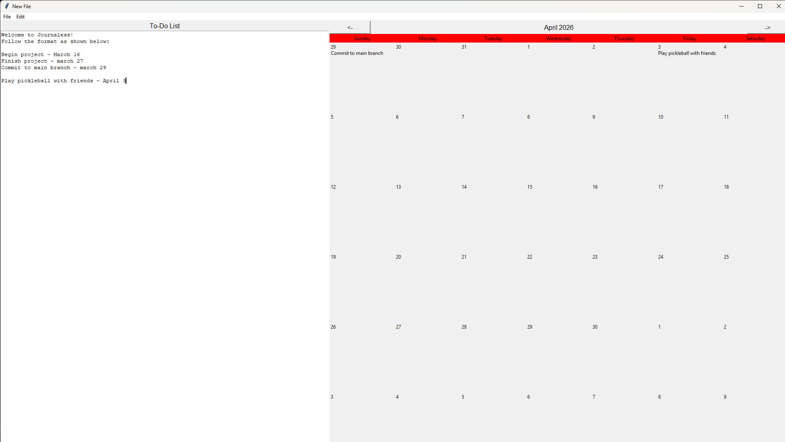

# Journaless
A basic to-do list app to take a .txt and place it onto a calendar.
Follow the basic structure of "task - month day" to set up task to be on calendar
Ex: Commit change - January 1

Basic features include:
Open .txt files and place them on the calendar
set a default file to open on start up
autosave on close
Click through different months

Keybinds - 
Ctrl-r - refresh the calendar
enter - refresh the calendar

Future improvements:
Add ability to change font size on the calendar
Improve window resizing & ui element alignment
add ability to highlight text in various colors
Add basic functions such as tab alignment for highlighted text
Add functionality for year to effect placement on calendar - currently only matches month/day to calendar

Showcase of Journaless:
Left hand side is a textbox that you can edit. Right hand side prints the task onto the calendar.
Notice how in the images the calendar correctly follows through on which month to place it.

